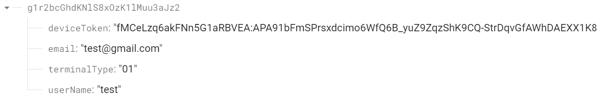

# firebase-ios-demo

## 前提準備  
  1.Firebase を Apple プロジェクトに追加する　[参照](https://firebase.google.com/docs/ios/setup)  
    ※　「ステップ 4」まで  

  2.Firebase 構成ファイルを保存する   
　  上記でダウンロードしたGoogleService-Info.plistファイルを本プロジェクトの[firebase-ios-demo/]に保存する。  

  3.Firebase Authenticationを設定する  
　　* <a href="https://console.firebase.google.com/">Firebase コンソール</a>で、[Authentication] セクションを開く。  
　　* [Sign-in method] タブで [メール / パスワード] を有効にして、[保存] をクリックする。  
　　* [Users] タブで[ユーザーを追加]でユーザーを追加する。  

 4.データベースを作成する　[参照](https://firebase.google.com/docs/database/android/start)    
　　* データベースを作成する。  

 5.APNs 認証キーをアップロードする  [参照](https://firebase.google.com/docs/cloud-messaging/ios/client)   

## 説明
  本プロジェクトは、ログインしたユーザーのデバイスtokenを取得し、ユーザー情報と共にデータベースに保存し（usersの下）、通知メッセージを受信する。

## 実行  
　1.アプリを起動する。
　2.[Authentication]で追加されたユーザーで[Sign In]、 又は追加されてないユーザーで[Sign Up]  
　3.データベースのデータを確認する。  
   
  4.(spring-boot-firebase-demo)から通知メッセージを受信する。   
    

